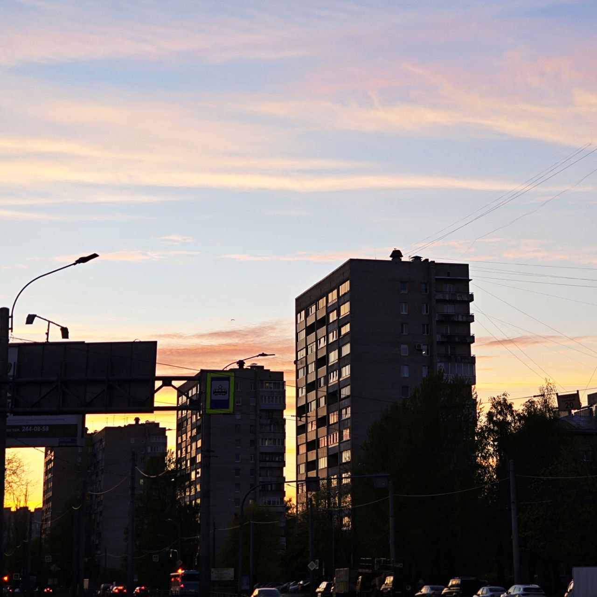
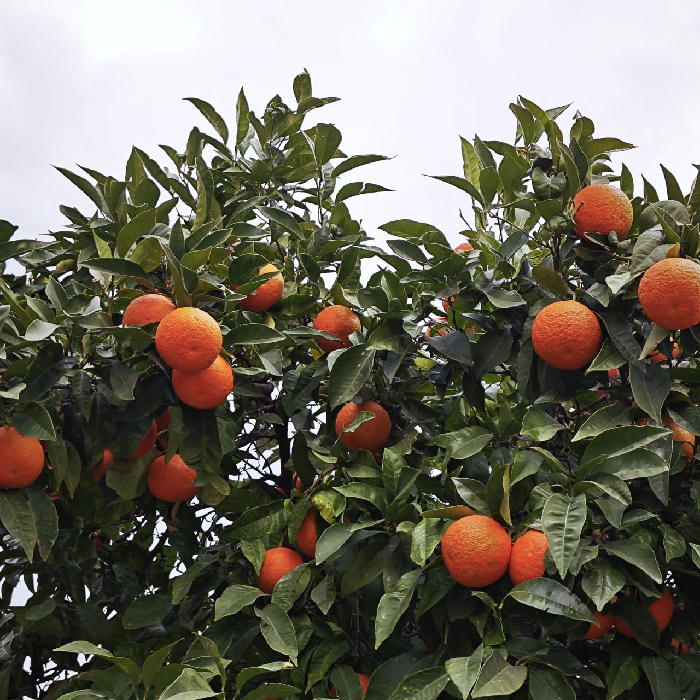
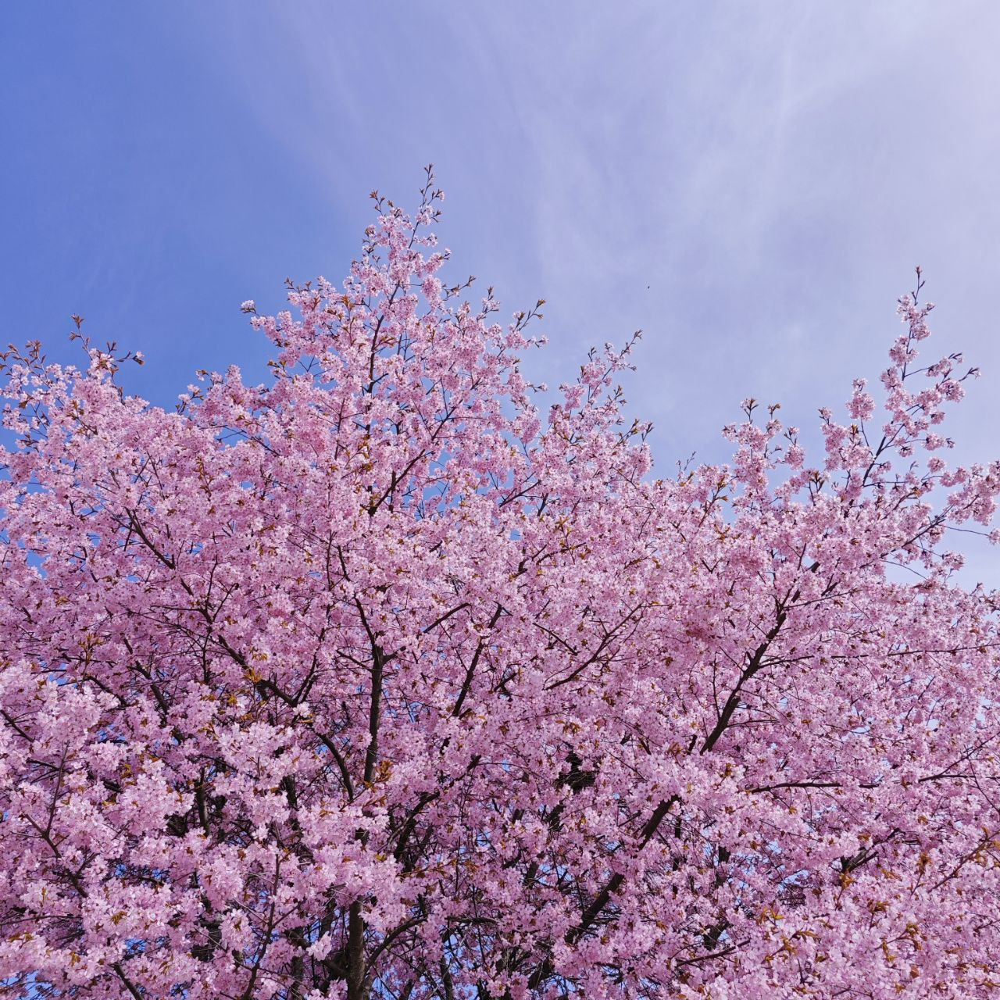

# Image compressor

This project is implementation of simple neural network that learn to reproduce the input image.

## Usage

For getting help:

```bash
python *.py -h
```

\* -- is the file name.

## Results

### 1

Original image:


Result of training:


The process of training:


### 2

Original image:


Result of training:


The process of training:


### 3

Original image:


Result of training:


The process of training:

